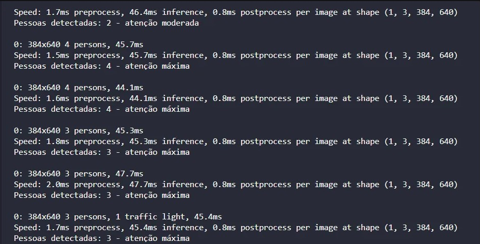

# Detecção de Pessoas com YOLO e Pose Estimation com MediaPipe

## Descrição do problema: detecção tardia de falta de energia

Em muitas comunidades, especialmente nas áreas rurais, periféricas ou em regiões com infraestrutura precária, o monitoramento automatizado da rede elétrica é inexistente ou muito limitado. Nesses locais, a detecção de quedas de energia frequentemente depende exclusivamente da comunicação manual dos moradores, que precisam ligar ou se deslocar até um centro de atendimento para relatar o problema.

### Isso gera diversos impactos negativos:

- **Demora na resposta**: As autoridades ou empresas responsáveis só tomam conhecimento após um morador avisar, o que pode levar horas ou até dias, dependendo da localidade.
- **Insegurança**: Falta de iluminação pública e de serviços essenciais (como hospitais e escolas) prejudicados.
- **Prejuízos econômicos**: Pequenos comerciantes ou agricultores que dependem de energia para conservar alimentos e produtos sofrem perdas financeiras.
- **Risco à vida**: Equipamentos médicos domiciliares, como respiradores ou aparelhos de diálise, podem parar de funcionar, colocando vidas em risco.

### Vídeo que mostra o cenário em que nossa solução iria atuar:
https://youtu.be/3zwUo7wA0kQ

## Solução criada: sistema embarcado com amperímetro:
Diante dessa problemática, nosso grupo desenvolveu o **Blackout Monitor**, um sistema embarcado que utiliza Arduino ou ESP32 integrado com um sensor de corrente (amperímetro) e um sensor de luminosidade (LDR). Além disso, a solução conta com uma câmera que, por meio de um algoritmo baseado nas bibliotecas Mediapipe e YOLO, analisa o nível de movimentação no local, ajudando a determinar a urgência da situação.

O objetivo é instalar o sistema em postes de iluminação pública em comunidades carentes, onde a detecção de falta de energia geralmente ocorre de forma tardia. Assim, o Blackout Monitor possibilita uma identificação rápida e automática de apagões, priorizando os casos mais críticos e otimizando o atendimento pelas equipes responsáveis.

### Como serão os logs feitos pelo Blackout Monitor:

### Vídeo que mostra como o blackout Monitor irá atuar:
https://youtu.be/aK1FIkL8JJs 

### Ferramentas usadas para fazer o algoritmo:

- **OpenCV:** biblioteca de processamento de imagens e visão computacional. É usada para capturar, ler e manipular vídeos ou imagens. No Blackout Monitor, ela permite que o arquivo .py capture o vídeo em tempo real e o envie para os modelos de detecção.

- **Ultralytics e YOLO:** modelo de rede neural para detecção de objetos. No Blackout Monitor, é usado para identificar e contar as pessoas presentes no vídeo. A partir desse número, o sistema consegue determinar o nível de urgência da situação (quanto mais pessoas, maior a prioridade).

- **mediapipe:** framework de visão computacional com foco em pré-processamento e pós-processamento. Ele possui modelos prontos para detecção de landmarks (mãos, rosto, corpo, etc). No Blackout Monitor, o Mediapipe é usado para desenhar os landmarks (pontos-chave) nas pessoas detectadas.

- **Observação importante:** O Mediapipe sozinho geralmente atua sobre toda a imagem ou detecta apenas uma pessoa por vez. Por isso, o YOLO é usado primeiro para localizar e separar cada pessoa. Assim, o Mediapipe pode processar cada indivíduo de forma isolada e desenhar os landmarks para cada pessoa detectada

### Como instalar as dependências:

caso use o ambiente virtual:

venv\Scripts\activate
pip install -r requirements.txt

Caso use o seu ambiente:

pip install ultralytics
pip install opencv-python
pip install mediapipe

### Integrantes do grupo:
- Nicolas Oliveira da Silva RM98939
- Guilherme Barreto RM97674
- Mateus Iago Sousa Conceição RM550270
